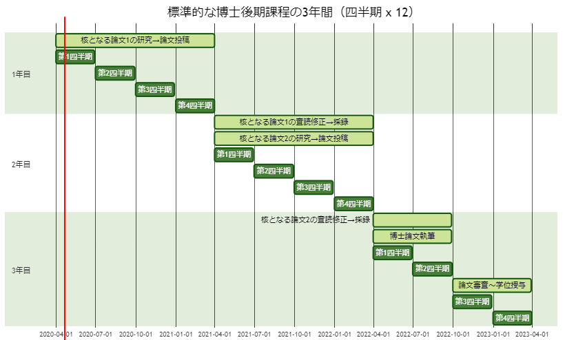

# 博士後期課程の時間管理

## 博士後期課程の3年間

:warning: 以下はフルタイム学生をモデルとしてます。

## 3年間の考え方

- 一番重要な点：自分の指導教員の指導を最優先しましょう。
- 3年間を四半期（3か月）が12回あると捉えてみましょう。
- 最低でも四半期ごとに研究計画や進捗の振り返りを実施しましょう。
  - 1-2週間の遅れを取り戻すことは可能ですが、3か月の遅れを取り戻すことは困難です。
- 3年目の1年間（四半期ｘ4回）は事実上大がかりな新規作業などは出来ず、博士論文の執筆と論文審査に費やされることを覚えておきましょう。
  - 核となる論文が2本あったとしても、博士論文として一つのストーリーにまとめ、足りない部分を補い、根本的な問題がないかを検証し、論文審査委員の先生方が理解できる文章になるまで推敲を繰り返す過程には、多くの時間が必要であることを覚えておきましょう。
  - また、この期間には投稿した「核となる論文」の修正をする時間が含まれていることを忘れないようにしましょう。
  - 博士論文の投稿から、予備審査と最終審査を経て、3月末に学位を授与するには、6か月ほどかかるのが現実的であることを覚えておきましょう。
- 以上のことから、博士論文の提出に必要な「核となる論文」2本の完成には、実質24か月（四半期ｘ8回）が与えらえれた時間であることを認識しましょう。
  - 単純計算で1本目の「核となる論文」の投稿までに1年目の12か月（四半期ｘ4回）、2本目の「核となる論文」の投稿までに2年目の12か月（四半期ｘ4回）が与えられた時間です。

## 「核となる論文」完成までの時間管理

- 論文の構成は研究テーマや分野によって大きく異なりますが、論文執筆と推敲に3か月（第4四半期）を想定しておくのは現実的です。
  - あなたの指導教員が渡された原稿を24時間で読んでくる可能性は非常に低いです。
- したがって論文1本あたりの執筆以外の作業は残された9か月（四半期ｘ3回）で行う必要があります。
- 指導教員と相談しながら、最初の四半期の目標を設定しましょう。以下は例です。
  - 包括的な文献レビュー（レビュー論文が執筆できる規模）
  - SOTA（State of the Art）手法の再現実験
  - プロタイプシステムの設計や開発
  - 研究で主に使用する機材やソフトウェアの習得
- 四半期の研究目標を設定する際には、必ず目に見えるアウトプットを設定しましょう。
